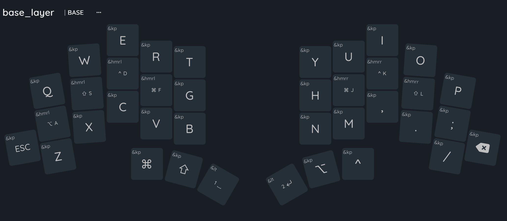
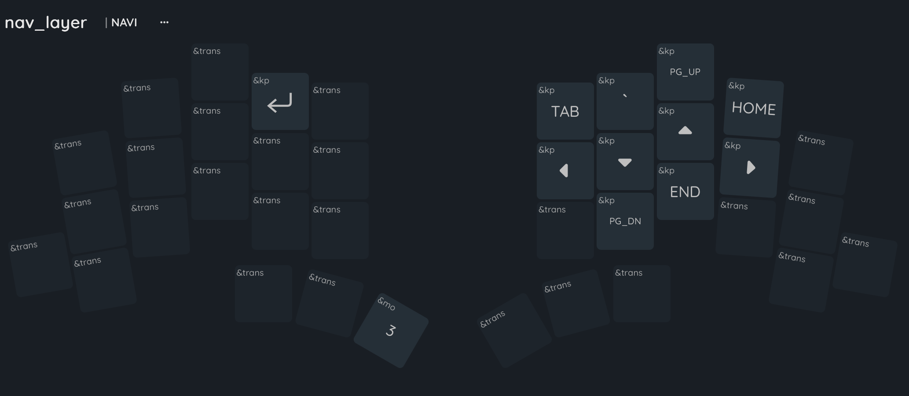
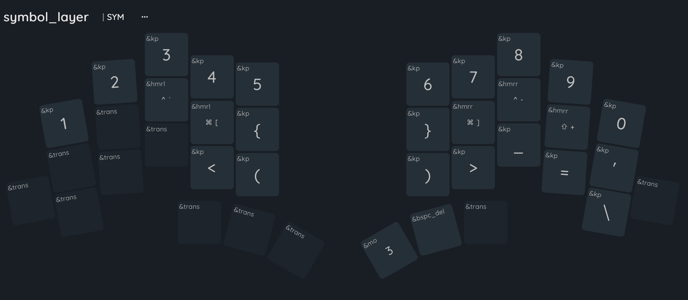
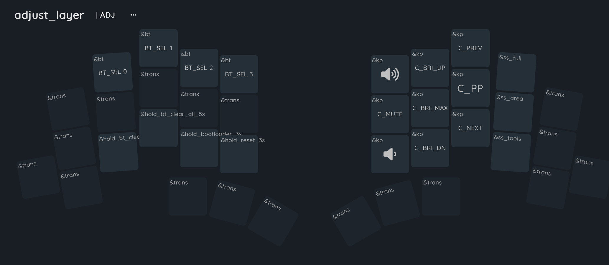

# hoffi-zmk
My shared ZMK configuration for split keyboards

## Keymap

### BASE

### NAV
Hold **Enter** to activate.

### SYM
Hold **Space** to activate.

### ADJ
Hold **Space + Enter** to activate.

### Home Row Mods

BASE:

- `S / L` → Shift
- `D / K` → Ctrl
- `F / J` → Cmd
- `A` → Alt (Right)

HMR uses opposite-hand triggering to reduce accidental holds
during normal typing.

Transparent (`&trans`) keys on other layers may intentionally
inherit HMR behavior from BASE.
